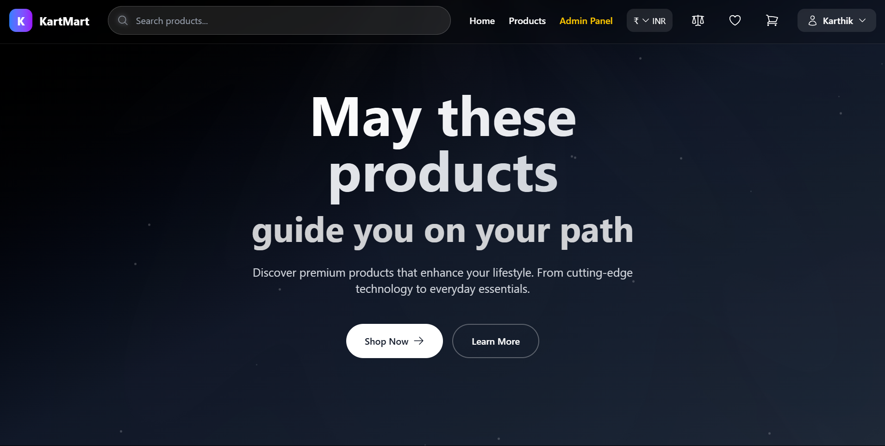
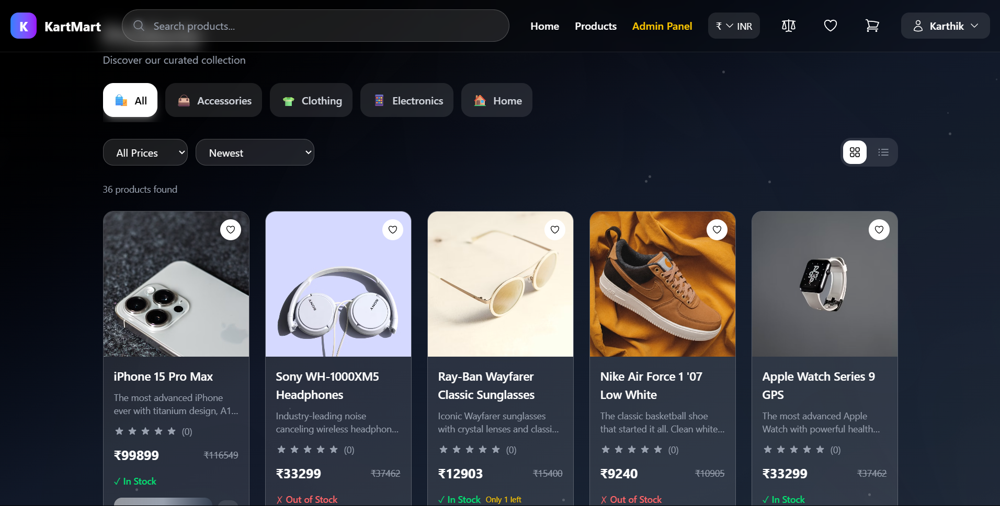
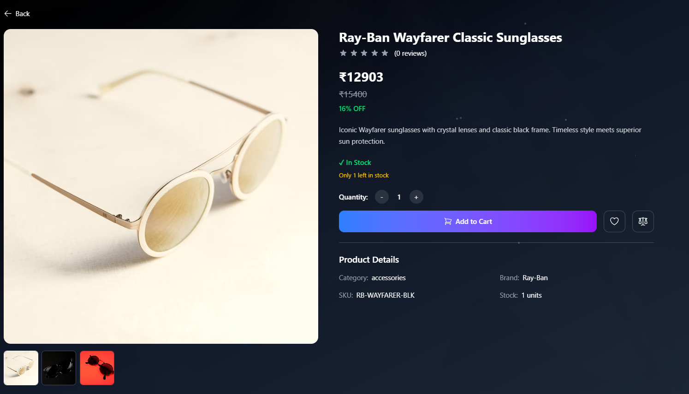
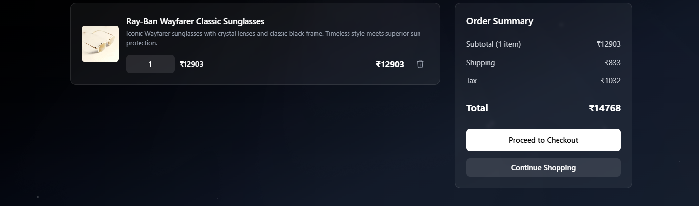
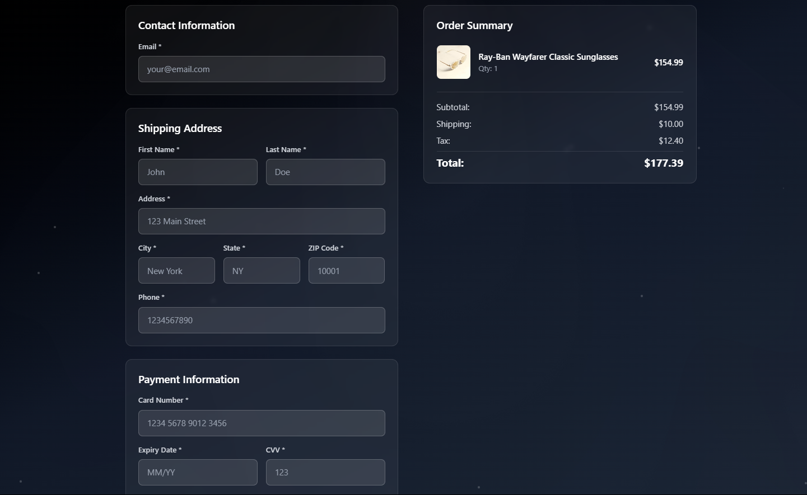
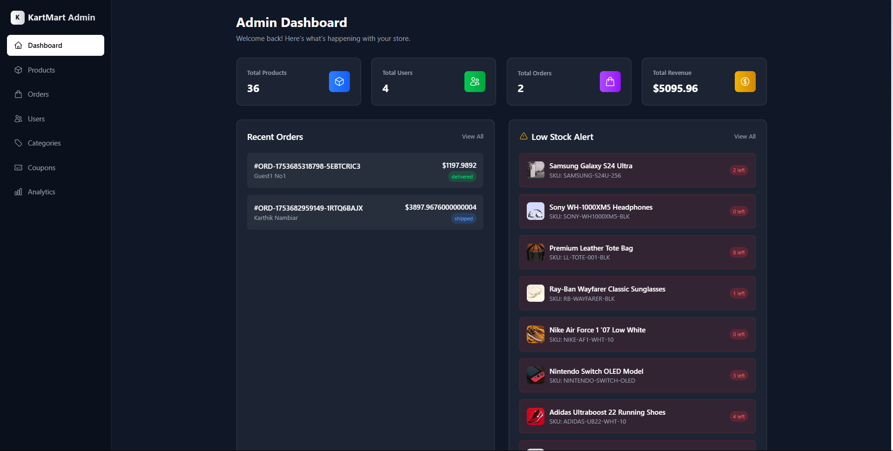

# KartMart 🛒

A full-featured e-commerce platform built with the MERN stack, offering a seamless shopping experience with modern UI/UX design.

## 📋 Overview

KartMart is a comprehensive e-commerce solution that provides users with an intuitive shopping experience. From browsing products to managing orders, KartMart handles all aspects of online retail with a focus on performance, security, and user satisfaction.

## ✨ Features

### 🛍️ User Features
- **User Authentication**: Secure login and signup functionality
- **Product Browsing**: Browse through categorized products with advanced filtering
- **Shopping Cart**: Add, remove, and manage items in cart
- **Wishlist/Favorites**: Save products for later purchase
- **Product Comparison**: Compare multiple products side by side
- **Checkout Process**: Streamlined checkout
- **Order Management**: View order history and track current orders
- **Profile Management**: Edit personal information and manage account settings
- **Currency Converter**: Live USD to INR price conversion and vice versa
- **Search & Filters**: Advanced search with multiple filter options

### 👨‍💼 Admin Features
- **Admin Dashboard**: Comprehensive admin panel for store management
- **Product Management**: Add, edit, and delete products
- **Order Management**: View and manage customer orders
- **User Management**: Monitor and manage user accounts
- **Analytics**: Track sales and user engagement metrics

### 🔧 Technical Features
- **Responsive Design**: Mobile-first approach with Tailwind CSS
- **Real-time Updates**: Live price updates and inventory management
- **Performance Optimized**: Fast loading times and smooth user experience

## 🚀 Live Demo

🔗 **[View Live Demo](https://kart-mart.vercel.app/)**  

## 🛠️ Technologies Used

### Frontend
- **React.js** - User interface library
- **Tailwind CSS** - Utility-first CSS framework
- **React Router** - Client-side routing  

### Backend
- **Node.js** - JavaScript runtime environment
- **Express.js** - Web application framework
- **MongoDB** - NoSQL database  

## 📸 Screenshots

### Homepage

> Modern and clean homepage with featured products

### Product Catalog

> Advanced filtering and search functionality

### Product Details

> Detailed product view with comparison option

### Shopping Cart

> Interactive shopping cart with quantity management

### Checkout Process

> Streamlined checkout process

### User Dashboard

> User profile and order history management

### Admin Panel

> Comprehensive admin dashboard

---

⭐ Star this repo if you find it helpful!